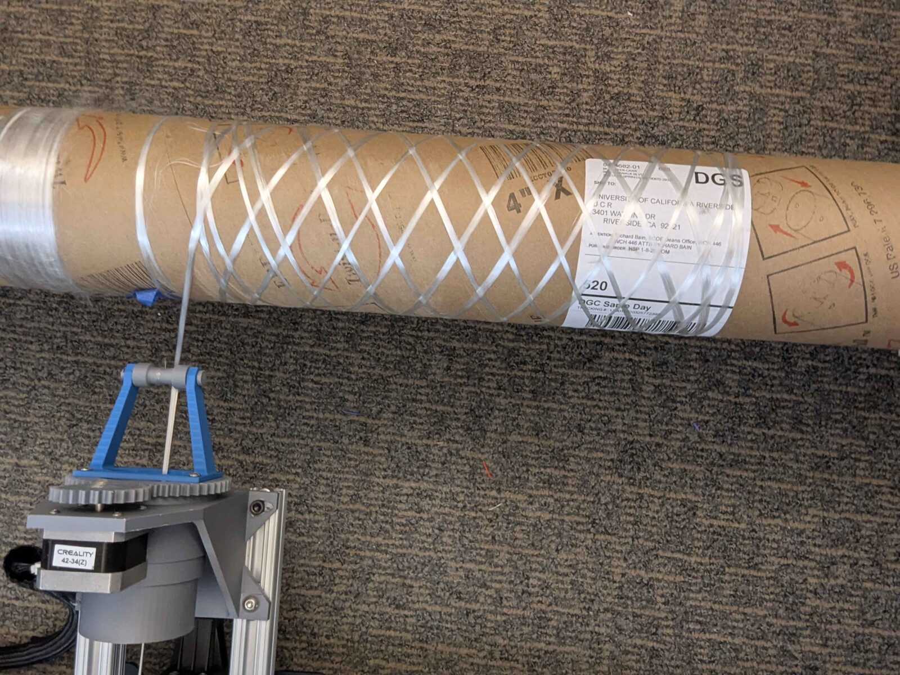
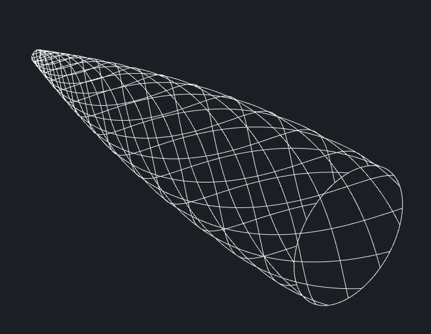
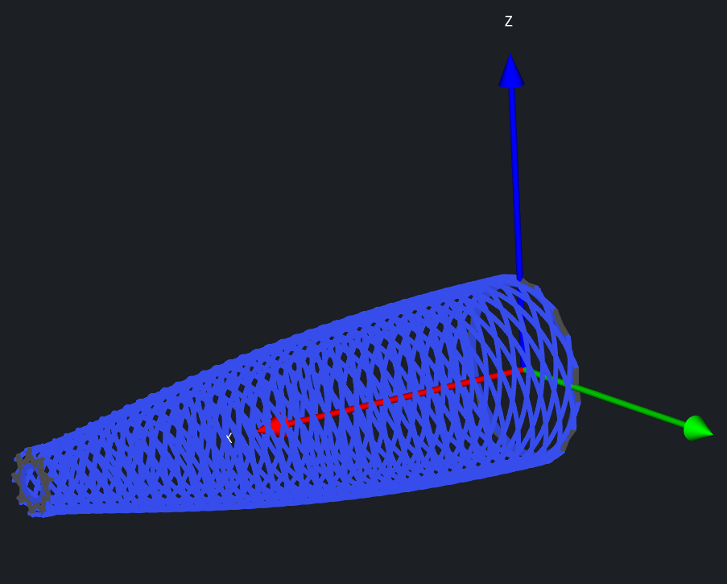
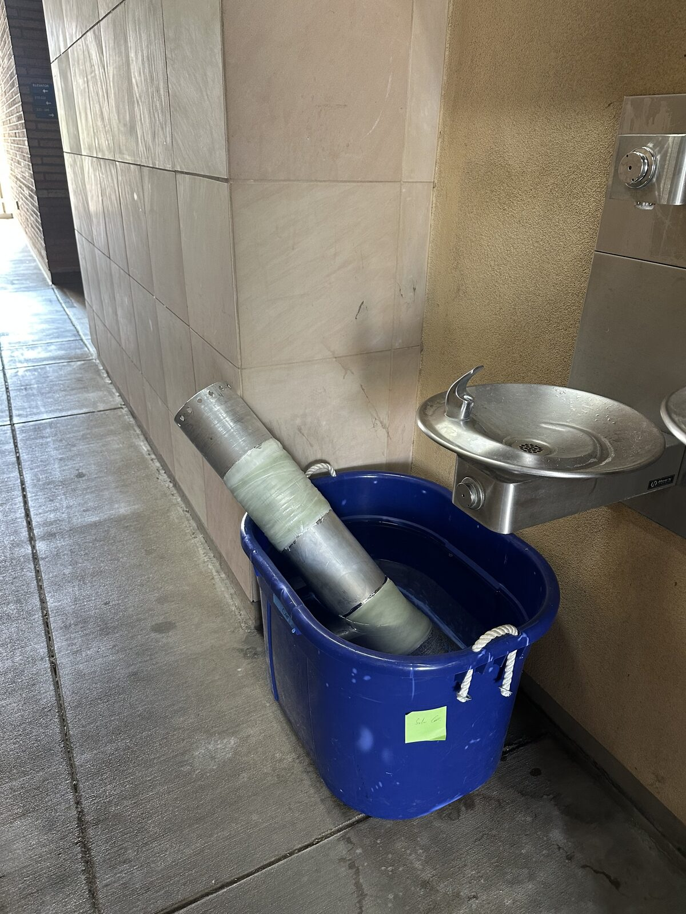

---
meta:
  - { key: Scope, value: "Independent project within [Highlander Space Program](https://www.instagram.com/hspucr/), year 2" }
  - { key: Role, value: Sole contributor }
skills: "composites manufacturing · motion control and G-code · Go and Python · geometric algorithms · design for manufacture · root cause analysis"
---

**At a glance**

- Based on Andrew Reilley's open-source Contraption winder; electronics rebuilt from a salvaged Ender 3
- 4-axis machine, operated in 2-axis configuration for process development
- Toolpath generator extended from cylinders-only to arbitrary axisymmetric profiles
  - Rewritten from Python to Go with a graphical path visualizer
- Did not reach production: mold release failed under winding tension, root cause identified
- github.com/raptor8134/cocoon/

## Why build a winder

Our team's composite airframe components were fabricated by hand layup. That process works, but it has two costs. It is labor-intensive (a tube consumes a full work session and multiple people) and it gives you little to no control over fiber orientation. You are tensioning braided sleeving over a mandrel by hand and accepting whatever angle the material settles into. For structures where the loads are known and the layup could be tailored to them, that is a lot of performance left unclaimed.

The buy-instead option had just failed decisively. In my first year I ran supplier and fabrication-method research for the team's composite components, and we placed a tube order with a vendor that delayed for roughly six months and ultimately never delivered. The company later closed and sold its equipment off. That experience is what pushed the question from "should we make our own tubing" to "we need to be able to make our own tubing."

Filament winding answers both problems at once: it is automatic, and fiber angle is a controlled parameter rather than an accident of handling.

## Machine build

I started from Andrew Reilley's Contraption, an open-source winder design, and adapted the mechanical design to the hardware I could actually get. The electronics came entirely out of the guts of a dead Ender 3 ( control board, steppers, drivers, supply) which meant reworking the machine's mechanical layout around what those components could drive rather than the reverse.

Running the machine on 3D printer firmware was a an easy cost and effort saving measure, especially since I had much more design than electronics experience. A filament winder and a 3D printer solve the same coordination problem: hold two axes in a fixed velocity ratio through a move. Winding a helical pass at a target fiber angle is a linear move in (mandrel rotation, carriage travel) space, which is exactly what a G1 command already expresses. Stock Ender 3 firmware with minor modification handles it, and I got a debugged motion stack, acceleration handling, and a mature G-code interpreter for free.

The full machine has four axes: mandrel rotation, carriage travel, filament head rotation, and standoff from the mandrel surface. I ran process development in a two-axis configuration, since head orientation and mandrel proximity matter for fiber placement quality but not for validating that the path geometry and release process work..

## Toolpath generation

The stock software was the real limitation. It supported cylindrical mandrels only, which meant the machine could produce tubes and nothing else — while the parts we most wanted automated were nosecones, where hand layup is hardest and fiber angle control matters most. It was also terminal-only. I generally prefer terminal tools, but a winding path on a non-trivial mandrel is a three-dimensional object built up over many passes and layers, and there is no reading it as text.

The core computation is the relationship between carriage travel and mandrel rotation needed to produce a target fiber angle relative to the mandrel axis. On a cylinder that ratio is a constant, which is why the stock implementation could get away with what it did. On any profile that changes diameter, the local circumference changes as the carriage advances, so the ratio has to be recomputed continuously along the path.

My generator takes a mandrel profile — either a list of points or a closed-form expression — and solves for dx/dθ along it, then discretizes the result into G-code moves that hold the fiber angle as close to target as the segmentation allows. It also solves pass distribution, spacing each pass of a helical layer around the mandrel circumference so a layer closes out with even coverage rather than overlapping bands and bare stripes.

The path solution is purely geometric and does not model friction. On a tapered surface a wound fiber under tension will tend to slip toward the small end unless the path is either geodesic or shallow enough that friction holds it — a non-geodesic winding constraint I did not implement. For the mandrel geometries in scope this was a known, accepted limitation rather than an oversight, and characterizing actual slip against predicted path was queued behind getting parts off the mandrel at all.

I rewrote the generator from Python to Go and added a GUI. Go for a compiled single binary and better performance on dense paths; the GUI because layer-by-layer visualization is the whole point of the extension. I used AI-assisted translation for the port and the interface code — the algorithmic work and validation of the output paths are mine, the language transfer and UI scaffolding were not where the engineering was.

## Where it failed

Although the winding process itself was solid, none of the resulting parts were usable. Every tube seized on its mandrel and had to be cut apart to be freed. The team fabricated by hand for that year's launch as planned.

The failure is in release, and the interesting part is why our known-good release methods stopped working. Our hand layups used single-use 3D printed mandrels wrapped in Mylar or aluminum foil as a barrier layer against direct adhesion. That approach was well proven for us and it had outperformed PVA release agent in practice. On the winder, both barrier films and PVA failed, on 3D printed mandrels and on aluminum pipe alike.

The mechanism is mechanical tension: Hand layup places material on a mandrel; winding actively pulls it down. Continuous filament tension compacts the laminate radially onto the tool as it is laid, with the compaction pressure scaling as tension over mandrel radius. A release strategy that only has to prevent adhesion is not sufficient once the part is being actively clamped to the tool by its own fiber tension.  Tension cannot be eliminated since it is necessary to pull filament off of the spool, and is also one of the advantages of the winding process, providing a compressive force between layers similar to vacuum bagging or flat pressing

Although another team member was able to develop two-part and three-part collapsing mandrels for tubes produced the following year, the winder project had to be shelved due to space constraints, and the general difficulty of training new members to use it compared to the hand layup process.
## What I would do differently

In retrospect, mold release should have been a much higher priority. My early tests were with mandrels thin and small enough to be destructively removed, and going from soda can to industrial pipe for the mandrel was a larger process change than I thought. My other mistake was building too large such that finding a suitable place to test was a persistent and program-ending problem, my original thinking was future proofing for building longer and larger rockets, but without succeeding in the present preparing for the future is useless.