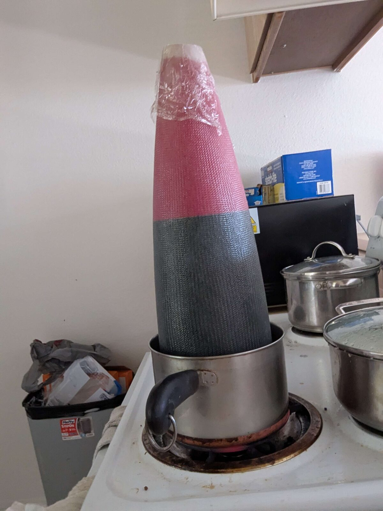

---
meta:
  - { key: Scope, value: "[ROCKETRY ORG], year 2" }
  - { key: Role, value: Airframe co-lead }
skills: "composites fabrication · wet layup and tooling design · design for assembly · team lead and process documentation"
---

**At a glance**

- Wet layup fiberglass over single-use printed tooling; parachute tubes, nosecone, and fin attachment
- Personally executed roughly half the hands-on composite work and was involved in every composite component
- Recruited and led a six-person sub-team on a first-article-then-delegate model
- **1st place, FAR-OUT competition** (scored across all elements of vehicle performance)

## The vehicle

Poseidon is a liquid bipropellant vehicle derived from the HalfCat reference design (nitrous oxide and ethanol, piston tank, and pintle injector) with a substantially enlarged and modified engine. The default upper airframe of the reference is cardboard, which wasn't going to fly for a 2x diameter increase. As airframe lead, I was responsible for the composite structure of the upper half of the vehicle. *[Vehicle length, diameter, and target altitude — TK]*

## Composite fabrication

**Wet layup over single-use printed tooling.** Prepreg was out on cost. Every part was laid up wet over 3D printed male mandrels wrapped in Mylar or aluminum foil, which served as a barrier against direct adhesion. We had tried PVA release agent and found the barrier film approach more reliable — worth noting because that conclusion held for hand layup and later proved invalid under filament winding tension, which is a separate project.

**Material.** Soller Composites 6" light biaxial fiberglass braided sleeve, 9.6 oz/yd², with West System epoxy and slow hardener. The slow hardener was chosen for working time: a full tube is a long layup with student labor, and pot life was the binding constraint on how much part we could complete in one session. Parts ran 3-5 plies depending on component. *[Ply schedule by part; cure and any post-cure — TK]*

**Why braided sleeving.** Biaxial braid over an axisymmetric mandrel can be tensioned by twisting both ends against each other, which consolidates the sleeve and conforms it to the tool. The braid trellises as it is tensioned — the fiber crossings scissor, the diameter shrinks, and the tension distributes evenly along the part rather than pulling locally. Practically, it means one person can get uniform consolidation on a long part without vacuum bagging.

The consequence worth flagging is that braid angle depends on the ratio of the sleeve's relaxed diameter to the local mandrel diameter. On a tapered part like the nosecone, the fiber angle therefore varies continuously along the length. *[Whether this was accounted for in ply selection, or characterized after the fact — TK]*

## Fin attachment

The fins bolt to the structural struts separating the motor from the fuel tank rather than being bonded through-wall or tip-to-tip laminated to the airframe.

The driver was transportability. A bonded fin can can is permanent and awkward to move; a bolted arrangement lets the vehicle come apart for transport and lets a damaged fin be replaced without touching the airframe. The tradeoff is lower joint stiffness and extra weight from steel bolts. This wasn't considered a huge issue as our mission profile was dependent on accuracy not pure altitude, and our velocity was not in the critical range for flutter. *[Fin material and construction; flutter margin — TK]*

## Team

I was co-lead of the airframe team and recruited six members into it. The working model was first-article-then-delegate: I developed and executed the first instance of a given process or part, then handed routine fabrication, calculations, and simulations to the team once the method was proven and documented. That kept process risk on me and let the sub-team produce volume without each member independently rediscovering how a layup goes wrong.

Earlier in the year we also built and flew a solid-motor kit rocket to test recovery systems. From the airframe side its main value was composite practice under low stakes.

## Result

Poseidon took **first place at the FAR-OUT competition**, scored on a points system combining all elements of vehicle performance.
