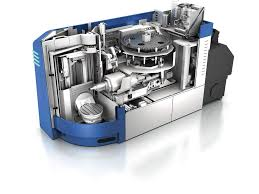
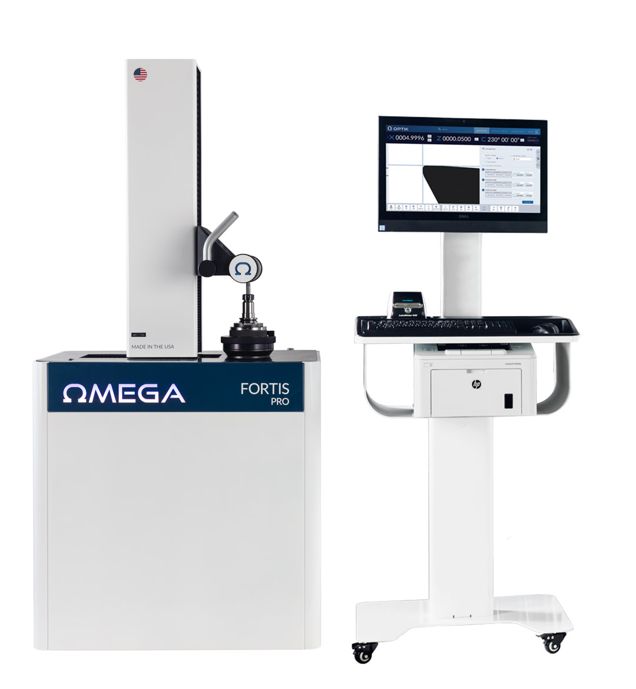
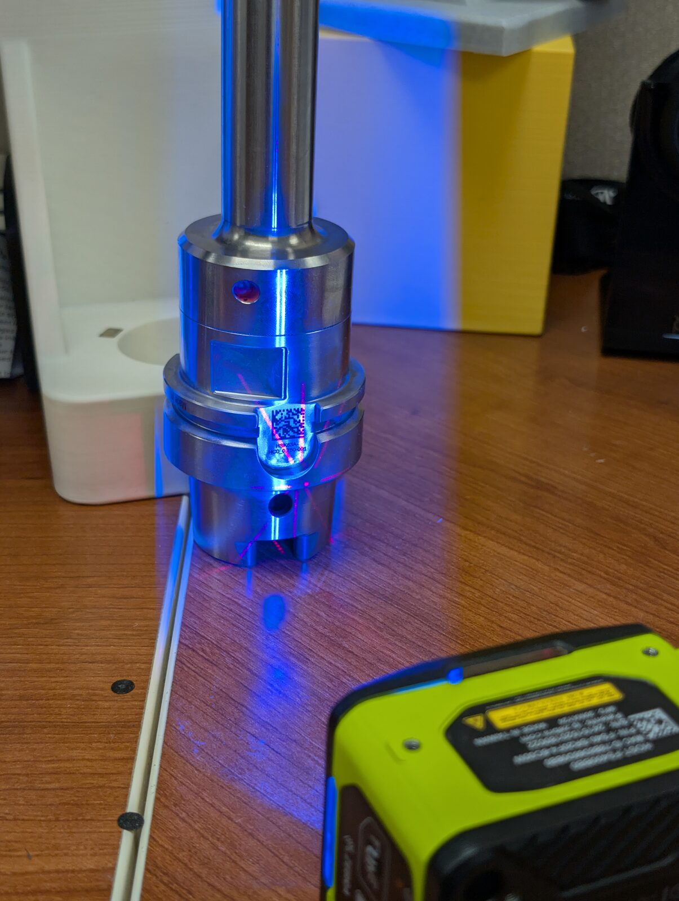

---
meta:
  - { key: Scope, value: "Manufacturing Engineering internship, Woodward Inc. — Santa Clarita, CA" }
  - { key: Role, value: Sole project engineer }
skills: "manufacturing process automation · industrial data integration · barcode and RFID tooling ID · VBA scripting · cost-of-quality analysis"
---

> [!note]
> I no longer have access to my digital files from this project — I either forgot to keep them or was not permitted to. This write-up is reconstructed from photographs (none from the shop floor) and handwritten notes, so it is less complete than it could be.

## The problem

In Summer 2025 I interned at Woodward, Inc. in Santa Clarita, CA under the Manufacturing Engineering department. My main project was a proof-of-concept automation for measuring and loading CNC tool offsets.

The existing workflow:

1. Operator precisely measures tooling on a presetting machine
2. Operator prints a label with the tooling information
3. Operator manually keys the tool offsets from the label into the CNC control

This is error-prone and slow — it runs for over 100 tools per job — and the operator carries responsibility for the tooling being correct. Scrap rates are technically low, but the forgings are expensive and the machine is new and costly, so it adds up. Using machinists' scrap-rate figures (the low end) and my supervisor's numbers for forging cost and labor rates, I estimated total losses from the current procedure at around $20,000 per year — mostly wasted forgings, with a few thousand in lost time.

Both machines can network and have dedicated functionality for exactly this. The catch is that setting it up correctly is very time-consuming and needs a specific solution per machine type — and per software version, which I found out the hard way. I had a general roadmap and sporadic emails from colleagues at another campus who had done something similar, but worked through the specific issues on my own.

## The approach

The general pattern for these projects is to attach a machine-readable ID to each piece of tooling so its data can be tied to the tool automatically. There are a few ways to do it. RFID tags on each holder are the easiest and most expensive — they encode the measurement data directly, and the GROB G350 can read them on load. A barcode or QR code on the tool is cheaper and harder — it is a lookup key into a networked database that has to be kept current. The barcode route is cheap to run and expand but a major pain to stand up.

")

Broken into steps:

1. The CAM programmer creates a tool list for a part.
2. They export it through WinTool (tool-management software) so each tool type and its nominal geometry is stored under a unique ID.
3. That ID is printed as a barcode on a physical tool list, which the operator scans when measuring — it queues the correct measurement program on the presetter instead of a manual selection.
4. The presetter also records the tool holder's serial number, identifying which *instance* of a tool is being measured. A WinTool ID is a *model* of a tool assembly; the serial number is a *specific holder*.
5. Once measured and in tolerance, the tooling data — serial number, WinTool ID, offsets, other geometry — is pulled from both the presetter and WinTool databases by a script on another server and written to a third, aggregate database that keeps only the most recent measurement per serial number.
6. When the tool is loaded, a fixed scanner on the CNC reads it during the loading sequence, coordinated by MiConnect on a dedicated PC. MiConnect pulls from the scanner and database and pushes to the CNC control — none of which the CNC does on its own.

## Marking and serialization

To mark the holders I used a laser marker to etch the barcode onto the flat that faces the CNC's fixed scanner — a good surface to etch and read, and in the right place.

Serial numbers had to be protected against duplication: a duplicate would load the wrong measurements into the CNC with no obvious error. I used a spreadsheet with VBA (ugly, I know) to query the main database for the lowest unused serial number and export it straight to a laser marking file. The file loads directly onto the marker, so there is no manual typing at that step either. The number is flagged used in the database as a placeholder before the tool is actually measured and added.

## The new workflow

1. Operator scans the tool holder barcode and tool list barcode with a handheld scanner when loading into the presetter. If the tool is not yet marked, they generate a new barcode with the serialization spreadsheet and etch it onto the correct flat.
2. Operator measures the tooling on the presetter; the data is pushed to the database.
3. Operator loads the tool into the CNC; the fixed scanner reads the barcode and the tooling data loads automatically via MiConnect.
4. MiConnect shows a prompt to review the tooling data and confirm it is correct.
5. Tool is loaded.

No more manual entry, and no more transcription errors.

## Cost

The system is not cheap, but it is roughly equal to the first year's savings, and it extends to more machines at much lower marginal cost — the spend is mostly one-time setup, software licenses, and equipment.
